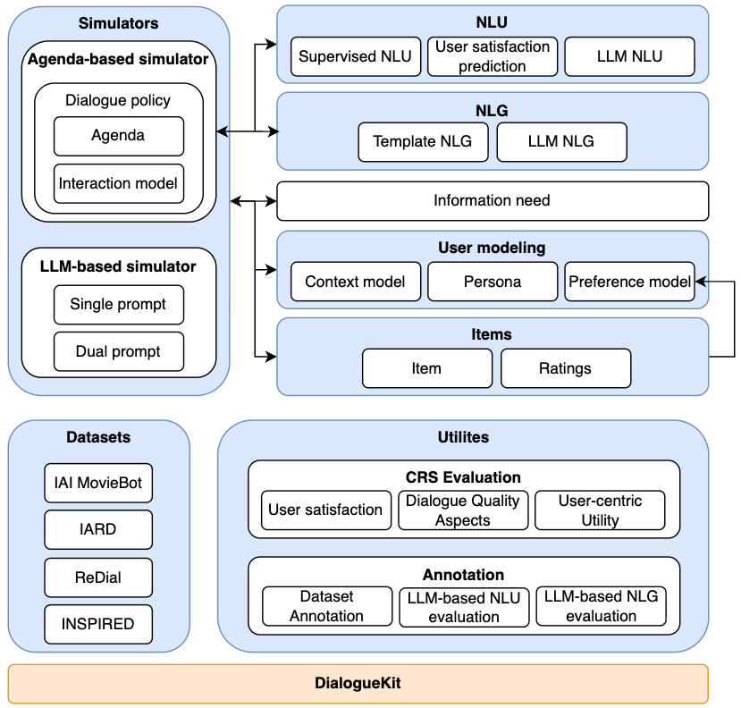

# :warning: Notice

> It appears that you have stumbled upon our GitHub repository as a result of our publication being [released on arXiv](https://arxiv.org/abs/2301.05544) ahead of schedule. While you are welcome to look around, please be advised that the code is not yet fully functional as we have been making a few breaking changes. We kindly ask that you check back at a later time for updates. Be assured, by the time of the WSDM conference, the code will be working as described and this message will be gone. Thank you for your understanding!

# UserSimCRS

 

UserSimCRS is an extensible user simulation toolkit for evaluating conversational recommender systems.  

It is built on top of the [DialogueKit](https://github.com/iai-group/dialoguekit) library, which provides basic dialogue management functionalities.

UserSimCRS follows the architecture of a typical task-based dialogue system, which consists of natural language understanding, response generation, and natural language generation components. Additionally, there is a dedicated user modeling component in order to make simulation more human-like.

  * **Natural language understanding** is responsible for obtaining a structured representation of text utterances.  Conventionally, it entails intent classification and entity recognition.  Additionally, we also include a classifier for user satisfaction prediction.
  * **Response generation** is currently based on agenda-based simulation, however, there are plans for extending the library with other approaches in the future.  Agenda-based response generation is based on an *interaction model*, which specifies the space of user and agent actions.
  * **User modeling** consists of three sub-components: *preference model* (to capture individual tastes, e.g., likes and dislikes), *context model* (to characterize the situation of the user, e.g., time of the day), and *persona* (to capture user-specific traits, e.g., user cooperativeness).  
  * **Natural language generation** is currently template-based, but it can be conditioned on context (e.g., users could use a different language depending on the time of day or based on their satisfaction with the system).

We refer to the [documentation](https://iai-group.github.io/UserSimCRS/) for details. Specifically, see [this page](https://iai-group.github.io/UserSimCRS/setup_agent.html) on how to set up an existing agent to be evaluated using UserSimCRS.

## Conventions

We follow the [IAI Python Style Guide](https://github.com/iai-group/styleguide/tree/main/python).

## Contributors

(Alphabetically ordered by last name) Jafar Afzali, Krisztian Balog, Aleksander Drzewiecki and Shuo Zhang
