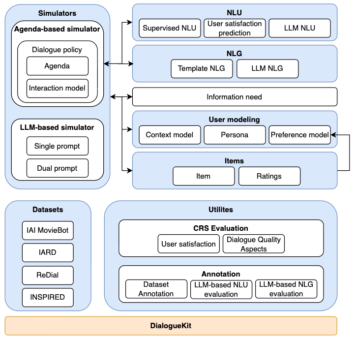

UserSimCRS |release| documentation
==================================

Conversational Recommender System Evaluation via Simulation

.. toctree::
   :maxdepth: 1
   :caption: Contents:

   intents: Dialogue actions that can be performed by the participants in a dialogue.
   intent_schema: Provides an overview of the action space, i.e., the set of intents that can take place in a dialogue. It also models the interaction flow between participants, i.e., User-System interactions. The default intent scheme is inspired by the work in `1 <https://strathprints.strath.ac.uk/64619/1/Azzopardi_etal_2018_Conceptualizing_agent_human_interactions_during_the_conversational_search_process.pdf>`_
   setup_agent
   :ref:`modindex`

Indices and tables
==================

* :ref:`genindex`
* :ref:`modindex`
* :ref:`search`

